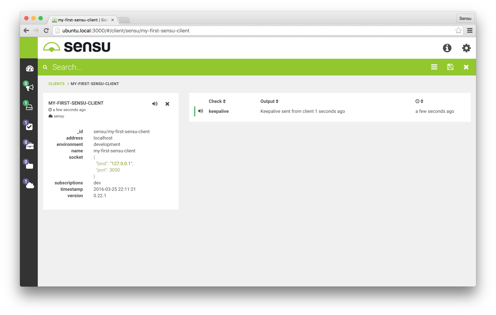

# The Five Minute Install

## Objective

Although Sensu’s [architecture][1] is one of its most compelling features, and
the [complete installation guide][2] can help you get Sensu installed and
configured for [a variety of operating environments][3], you might not actually
care about any of that until you can get Sensu up and running in a development
environment for testing purposes. This installation guide is intended to help
you to **install Sensu Core in five minutes or less, <abbr title='all $0 of it
you paid for that "free as in beer" open source software :)'>or we'll give you
your money back</abbr>, guaranteed**.

After completing the steps in this guide, you will have a fully functional Sensu
Core installation in a [standalone][4] configuration.

## Installation Requirements

What will you need to complete this guide?

- A virtual machine, or physical computer running 64-bit
  [CentOS 7][5] with a minimum of 2GB of memory (4GB recommended)
- Familiarity with a <abbr title='do you even pipe to grep?!'>command-line
  interface</abbr>
- Willingness to run a [shell script downloaded from the internet][6]
  ([or not][7])
- The commitment to count to [ten][8] (the number of steps in this guide)
- 300 seconds (the amount of time it should take to complete this installation)

Ready? Let's get started!

## Install Sensu in 5-minutes or less {#install-sensu}

The following installation steps will help you get Sensu Core installed in a
[standalone][4] on a system running [CentOS 7][5], only. For installation on
other platforms, and/or alternative installation configurations, please consult
the [installation guide](2).

1.5. Install EPEL (if not already done)
   ~~~ shell
   sudo yum install epel-release -y
   ~~~

1. Create the YUM repository configuration file for the Sensu Core repository at
   `/etc/yum.repos.d/sensu.repo` or see [Sensu Enterprise repository instructions][9]:

   ~~~ shell
   echo '[sensu]
   name=sensu
   baseurl=https://sensu.global.ssl.fastly.net/yum/$releasever/$basearch/
   gpgcheck=0
   enabled=1' | sudo tee /etc/yum.repos.d/sensu.repo
   ~~~

2. Install Redis (>= 1.3.14) from EPEL:

   ~~~ shell
   sudo yum install redis -y
   ~~~

3. Make sure Redis is started:

   ~~~ shell
   sudo systemctl start redis.service
   ~~~

4. Install Sensu & Dashbard

   ~~~ shell
   sudo yum install sensu uchiwa -y
   ~~~

   ...and if you're using [Sensu Enterprise][9], let's go ahead and install
   Sensu Enterprise as well:

   ~~~ shell
   sudo yum install sensu-enterprise sensu-enterprise-dashboard -y
   ~~~

5. Configure Sensu server:

  Run the following to set up a minimal client config:

   ~~~ shell
   echo '{
     "transport": {
       "name": "redis"
     },
     "api": {
       "host": "127.0.0.1",
       "port": 4567
     }
   }' | sudo tee /etc/sensu/config.json
   ~~~

6. Configure the Sensu client

  Run the following to set up a minimal client config:

   ~~~ shell
   echo '{
     "client": {
       "environment": "development",
       "subscriptions": [
         "dev"
       ]
     }
   }' |sudo tee /etc/sensu/conf.d/client.json
   ~~~

7. Configure a Sensu dashboard

   Run the following to set up a minimal dashboard config:

   ~~~
   echo '{
     "sensu": [
       {
         "name": "sensu",
         "host": "127.0.0.1",
         "port": 4567
       }
     ],
     "dashboard": {
       "host": "0.0.0.0",
       "port": 3000
     }
   }' |sudo tee /etc/sensu/dashboard.json
   ~~~

8. Make sure that the `sensu` user owns all of the Sensu configuration files:

   ~~~ shell
   sudo chown -R sensu:sensu /etc/sensu
   ~~~

9. Start the Sensu services

   Sensu Core users:

   ~~~ shell
   sudo systemctl start sensu-server.service
   sudo systemctl start sensu-api.service
   sudo systemctl start sensu-client.service
   ~~~

   Sensu Enterprise users:

   ~~~ shell
   sudo systemctl start sensu-enterprise.service
   sudo systemctl start sensu-enterprise-dashboard.service
   sudo systemctl start sensu-client.service
   ~~~

10. Verify that your installation is ready to use by querying the Sensu API
    using the `curl` utility (and piping the result to the [`jq` utility][10]):

    ~~~ shell
    sudo yum install jq curl -y
    curl -s http://127.0.0.1:4567/clients | jq .
    ~~~

    If the Sensu API returns a JSON array of Sensu clients similar to this:

    ~~~ shell
    $ curl -s http://127.0.0.1:4567/clients | jq .
    [
      {
        "timestamp": 1458625739,
        "version": "0.28.0",
        "socket": {
          "port": 3030,
          "bind": "127.0.0.1"
        },
        "subscriptions": [
          "dev"
        ],
        "environment": "development",
        "address": "127.0.0.1",
        "name": "client-01"
      }
    ]
    ~~~

    ...you have successfully installed and configured Sensu!

    If you you're using Sensu Enterprise, you should also be able to load the
    Sensu Enterprise Dashboard in your browser by visiting
    [http://hostname:3000](http://hostname:3000) (replacing `hostname` with the
    hostname or IP address of the system where the dashboard is installed).

    
    

[1]:  ../overview/architecture.html
[2]:  ../installation/overview.html
[3]:  ../installation/installation-strategies.html
[4]:  ../installation/installation-strategies.html#standalone
[5]:  https://wiki.centos.org/Manuals/ReleaseNotes/CentOS7
[6]:  http://github.com/sensu/sensu-bash
[7]:  ../platforms/sensu-on-rhel-centos.html#install-sensu-core-repository
[8]:  https://www.youtube.com/watch?v=J2D1XF40-ok
[9]:  ../platforms/sensu-on-rhel-centos.html#install-sensu-enterprise-repository
[10]: https://stedolan.github.io/jq/
